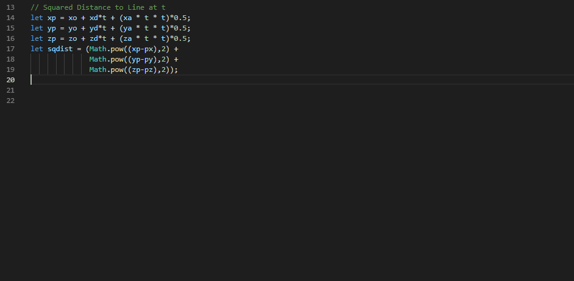

# Vertali

A work-in-progress (read: buggy) VS Code Plugin for Vertically Aligning Text for more visually pleasing code.

## Features

> Allows users to highlight blocks of code and right-click to vertically align them by special characters.

## Known Issues

- It often produces incorrect results, or results with extra spaces.

### Future Work

 - Fix the bugs
 - Produce more intuitive results when applied to the entire file.

## Release Notes

### 0.0.1 - Proof of Concept

Initial proof of concept.
